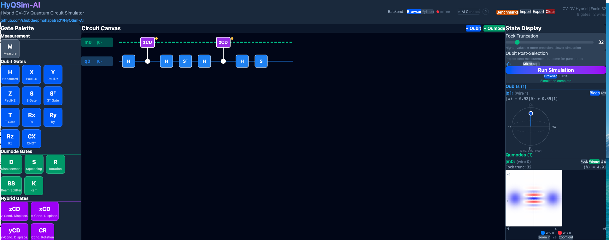

# HyQSim-AI

**A visual simulator for hybrid CV-DV quantum circuits, with an AI assistant that builds and
explains them.**

Build circuits mixing **qubits** (discrete, two-level) with **qumodes** (continuous bosonic
modes — cavities, optical modes, oscillators), simulate them, and see the resulting Wigner
functions, Bloch spheres and photon-number distributions. Then describe a circuit in words
and watch it appear, or ask what the one on your canvas is doing.



```
"Build a cat state circuit with alpha = 2 using a qubit and a qumode"
   → 8 gates appear on the canvas, Fock truncation set to 32

"What kind of output will this circuit give?"
   → runs the simulator, then explains the even-photon comb and the Wigner negativity
     using the numbers it just produced
```

**[→ Start with the WALKTHROUGH](WALKTHROUGH.md)** — 15 minutes, from an empty canvas to a
Schrödinger cat state and back out again through the AI.

## Documentation

| | |
|---|---|
| **[WALKTHROUGH.md](WALKTHROUGH.md)** | Step-by-step tour. Start here |
| **[AI_GUIDE.md](AI_GUIDE.md)** | The AI assistant in full: both connection modes, keyword glossary, circuit notation, token costs, testing |
| **[CHANGELOG.md](CHANGELOG.md)** | What changed in the AI overhaul, and why |
| **[NEXT_STEPS.md](NEXT_STEPS.md)** | Open threads, known gaps, and constraints to preserve |
| **[CONTRIBUTING.md](CONTRIBUTING.md)** | Development setup and workflow |

## Overview

HyQSim-AI simulates quantum circuits that combine traditional qubits with bosonic qumodes
(quantum harmonic oscillators) — the regime of superconducting cavities coupled to transmon
qubits, and of most photonic hardware. Purely discrete simulators cannot represent these
systems; purely continuous ones cannot represent the qubit.

The AI assistant closes the gap between describing a state and constructing it. It is
constrained by design: **it never computes physics.** Every number it reports comes from
HyQSim's own simulator, and asking it to explain a circuit cannot cause it to modify one.

### Simulator Features

- **Drag-and-drop circuit builder** - Intuitive interface for constructing quantum circuits
- **Dual backend support** - Browser-based JavaScript simulator or Python backend with bosonic-qiskit
- **Real-time visualization** - Bloch sphere for qubits, Wigner function and Fock distribution for qumodes
- **Hybrid gates** - Support for qubit-qumode interactions (controlled displacement, controlled rotation)
- **Configurable Fock truncation** - Adjust precision vs. performance tradeoff

### AI Assistant Features

> **📘 Full documentation: [AI_GUIDE.md](AI_GUIDE.md)** — setup for both connection modes, the keyword glossary, prompt examples, the circuit notation, and how to test it all.

- **Natural language to circuit** - Describe any quantum state or protocol and the AI builds it on the canvas in a single tool call
- **Circuit interpretation** - Ask the AI to explain what a circuit does; it reads the canvas and simulation results and gives a physics-first narrative (state identity, phase-space picture, non-classicality signatures)
- **The AI never computes physics** - Every number it reports comes from HyQSim's own simulator. For a results question it triggers a real simulation run and waits, rather than guessing
- **Two ways to connect** - The in-app chat panel (bring an API key; Groq's free tier works), or **MCP** so Claude Desktop / Claude Code drives the canvas on your existing subscription with no API tokens at all
- **Read-only requests are enforced** - Asking for an explanation cannot modify your circuit; mutating tools are refused outright
- **Wigner-aware** - Plots are summarised as physical features (negativity volume, fringe count and spacing, quadrature variances) rather than 6400 raw floats
- **Verified circuits over improvisation** - For known constructions (cat state, CV↔DV transfer) the assistant loads the repository's verified circuit rather than reconstructing it from memory, which language models do badly
- **Token-efficient** - 76% fewer input tokens and under a third of the API round-trips versus the previous design; building a 4-qubit GHZ went from 10 round-trips to 2. Measure it yourself with `npm run ai:budget`
- **Multi-provider support** - Groq (free), Google Gemini (free), OpenAI, Anthropic Claude, Mistral, Together AI; bring your own key or use a server-side one
- **Resilient tool calling** - Fallback parser recovers tool calls from models that emit pseudo-XML as text; gate-name aliases and `pi/2`-style parameters are accepted; exponential backoff handles rate limits

## Quick Start

### Prerequisites

- Node.js 18+
- Python 3.10+
- git

#### macOS

```bash
# Install Homebrew if not installed
/bin/bash -c "$(curl -fsSL https://raw.githubusercontent.com/Homebrew/install/HEAD/install.sh)"

# Install prerequisites
brew install node python@3.12 git
```

#### Windows

1. **Node.js**: Download and install from https://nodejs.org/ (LTS version)
2. **Python**: Download and install from https://python.org/ (check "Add to PATH" during install)
3. **git**: Download and install from https://git-scm.com/

Or using [winget](https://learn.microsoft.com/en-us/windows/package-manager/winget/):
```powershell
winget install OpenJS.NodeJS.LTS
winget install Python.Python.3.12
winget install Git.Git
```

### Installation

Clone the repository and run the installation script using git-bash:

```bash
git clone <repository-url>
cd HyQSim
./install.sh
```

This will:
- Install frontend dependencies (npm packages)
- Create a Python virtual environment
- Install backend dependencies
- Clone and install bosonic-qiskit

### Running HyQSim

Start both frontend and backend:

```bash
./run.sh start
```

Then open http://localhost:5173 — and follow the **[WALKTHROUGH](WALKTHROUGH.md)**.

> If `run.sh` reports no Python venv, that is only the backend. The browser simulator and
> the in-app AI chat both work without it; the venv is needed for bosonic-qiskit, the MCP
> server, and server-side API keys.

### Run Commands

| Command | Description |
|---------|-------------|
| `./run.sh start` | Start both frontend and backend |
| `./run.sh stop` | Stop both servers |
| `./run.sh frontend` | Start frontend only (browser simulation) |
| `./run.sh backend` | Start backend only |
| `./run.sh status` | Check if servers are running |

### Browser-Only Mode

If you only want to use the browser-based simulator (no Python backend):

```bash
cd frontend
npm install
npm run dev
```

The simulator will run entirely in your browser with JavaScript. Some features like accurate bosonic-qiskit simulation won't be available.

## Architecture

```
HyQSim-AI/
├── frontend/                  # React + TypeScript + Vite
│   ├── src/
│   │   ├── components/        # UI components
│   │   │   ├── ChatPanel.tsx  # AI chat panel (tool dispatch, history, UI)
│   │   │   └── ...
│   │   ├── ai/                # AI assistant layer
│   │   │   ├── client.ts      # Agent loop, retry logic, rate-limit handling
│   │   │   ├── providers.ts   # Multi-provider request building and response parsing
│   │   │   ├── tools.ts       # Tool schemas, system prompt, parseToolCall
│   │   │   ├── hqc.ts         # HQC circuit notation: encode/decode/validate
│   │   │   ├── intent.ts      # build vs. explain vs. analyze classification
│   │   │   ├── circuitToPrompt.ts  # Simulation result serialization
│   │   │   └── evals/         # Prompt suite + budget/replay/live test runners
│   │   ├── mcp/session.ts     # WebSocket bridge for external AI clients
│   │   ├── simulation/        # Browser-based quantum simulator
│   │   │   ├── wigner.ts      # Wigner distributions (shared with the display)
│   │   │   └── wignerFeatures.ts  # 80×80 grid → ~40 tokens of physical features
│   │   ├── api/               # Backend API client
│   │   └── types/             # TypeScript type definitions
│   └── ...
├── backend/                   # Python + FastAPI
│   ├── simulation/
│   │   ├── bosonic.py         # bosonic-qiskit integration
│   │   ├── hqc.py             # HQC notation (Python mirror of ai/hqc.ts)
│   │   └── models.py          # Pydantic models
│   ├── tests/                 # pytest: HQC parity + MCP end-to-end
│   ├── mcp_server.py          # MCP server — drive HyQSim from Claude
│   ├── session.py             # Live canvas sessions bridging MCP ↔ browser
│   ├── main.py                # FastAPI server + AI proxy + session endpoints
│   ├── .env.example           # API key configuration template
│   └── requirements.txt
├── shared/                    # Generated by `npm run ai:gatespec`
│   ├── gates.json             # Gate catalogue, so hqc.py cannot drift from hqc.ts
│   └── hqc_cases.json         # Golden fixtures checked by both test suites
├── docs/images/               # Screenshot specifications
├── WALKTHROUGH.md             # Step-by-step tour — start here
├── AI_GUIDE.md                # Full AI documentation
├── CHANGELOG.md               # What changed in the AI overhaul
└── README.md
```

## Key Components

### Frontend Components

| Component | File | Description |
|-----------|------|-------------|
| **GatePalette** | `components/GatePalette.tsx` | Categorized list of available quantum gates |
| **CircuitCanvas** | `components/CircuitCanvas.tsx` | Main canvas for building circuits with wires and gates |
| **ChatPanel** | `components/ChatPanel.tsx` | AI assistant chat UI; dispatches tool calls to canvas mutations |
| **DisplayPanel** | `components/DisplayPanel.tsx` | Simulation controls and state visualization |
| **QubitDisplay** | `components/QubitDisplay.tsx` | Bloch sphere visualization for qubit states |
| **QumodeDisplay** | `components/QumodeDisplay.tsx` | Wigner function and Fock distribution for qumode states |

### AI Layer

| Module | File | Key Functions |
|--------|------|---------------|
| **Agent loop** | `ai/client.ts` | `runAgentTurn()` — multi-turn tool-calling loop with retry and rate-limit backoff |
| **Providers** | `ai/providers.ts` | `buildRequest()` / `parseResponse()` — OpenAI and Anthropic wire formats; `providerForModel()` — single source of truth for model→provider routing; `parseFunctionCallText()` — recovers tool calls from pseudo-XML text |
| **Tools** | `ai/tools.ts` | `AI_TOOLS` — tool schema registry; `SYSTEM_PROMPT`; `parseToolCall()` — validates tool calls into canvas mutations, with self-correcting error messages |
| **Notation** | `ai/hqc.ts` | `encodeCircuit()` / `decodeCircuit()` — the compact HQC circuit notation; `placeGate()` — shared validation; `parseNumber()` — accepts `pi/2`, `3pi/4` |
| **Intent** | `ai/intent.ts` | `classifyIntent()` — build vs. explain vs. analyze; decides whether tools are forced and whether the simulator auto-runs |
| **Serialization** | `ai/circuitToPrompt.ts` | `simulationResultToPrompt()` — compact Fock, Bloch, and Wigner-feature encoding |
| **Wigner features** | `simulation/wignerFeatures.ts` | `computeWignerFeatures()` — reduces an 80×80 grid to negativity, fringes, symmetry, and quadrature variances |
| **MCP bridge** | `mcp/session.ts` | `CanvasSession` — WebSocket link letting an external AI client drive the canvas |

### AI Tools (what the assistant can do)

| Tool | Description |
|------|-------------|
| `build_circuit` | Builds or replaces the entire circuit in **one** call — the main path for "build me a X" |
| `add_gate` | Appends a single gate (for edits) |
| `remove_gate` | Removes a gate by its canvas position number (`#3`) |
| `add_wire` | Adds a qubit or qumode wire |
| `clear_circuit` | Clears all wires and gates |
| `read_circuit` | Reads the current canvas state |
| `run_simulation` | **Triggers HyQSim's simulator** and returns its results — the AI never computes them itself |

The MCP server exposes the same capabilities as `hyqsim_*` tools; see [AI_GUIDE.md](AI_GUIDE.md).

### Simulation Backends

| Backend | Location | Use Case |
|---------|----------|----------|
| **Browser (JS)** | `frontend/src/simulation/` | Quick simulations, no server required |
| **Python (bosonic-qiskit)** | `backend/simulation/bosonic.py` | Accurate CV-DV simulation using Qiskit |

### Supported Gates

**Qubit Gates:**
- Single: H, X, Y, Z, S, S†, T, Rx(θ), Ry(θ), Rz(θ)
- Two-qubit: CNOT

**Qumode Gates:**
- Displacement D(α)
- Squeeze S(z)
- Phase Rotation R(θ)
- Beam Splitter BS(θ, φ)

**Hybrid Gates:**
- Controlled Displacement CD(α)
- Controlled Rotation CR(θ)

## AI Setup

**See [AI_GUIDE.md](AI_GUIDE.md) for the full guide.** In brief, there are two ways to connect:

### Option 1 — In-app chat panel (bring an API key)

Open the chat panel below the canvas, select a model, paste your key, and start prompting.

| Provider | Free Tier | Where to get a key |
|----------|-----------|-------------------|
| **Groq** (Llama 70B) | Yes — no credit card | [console.groq.com](https://console.groq.com) |
| **Google Gemini 2.0 Flash** | Yes — largest free budget | [aistudio.google.com](https://aistudio.google.com) |
| **Anthropic Claude** | No | [console.anthropic.com](https://console.anthropic.com) |
| **OpenAI** | No | [platform.openai.com](https://platform.openai.com) |
| **Mistral** | No | [console.mistral.ai](https://console.mistral.ai) |

Keys are kept in your browser's `localStorage` and are sent only to the provider you selected.

### Option 2 — MCP (use your Claude subscription, no API tokens)

Register the bundled MCP server with Claude Desktop or Claude Code, click **AI Connect** in the HyQSim header, and ask Claude to build circuits — they appear live on your canvas.

```bash
pip install 'mcp>=2.0.0'
claude mcp add hyqsim -- python3 /absolute/path/to/HyQSim-AI/backend/mcp_server.py
```

Simulation still runs in HyQSim: when Claude asks for results, the request is forwarded to your browser, which runs the simulator and sends back what it produced.

### Server-Side API Keys (for shared deployments)

To let users of a hosted instance skip keys entirely, add them to `backend/.env`:

```
ANTHROPIC_API_KEY=sk-ant-...
GROQ_API_KEY=gsk_...
GOOGLE_API_KEY=AIza...
OPENAI_API_KEY=sk-...
```

Models backed by a server key appear with a ★ in the model dropdown; keys never leave the server.

> ⚠️ **If the backend is reachable from the internet, set `AI_PROXY_TOKEN`.** The `/ai/chat` proxy spends your API credits on a caller-controlled request body — without a token anyone who can reach it can run arbitrary prompts on your bill. Set the same value as `VITE_AI_PROXY_TOKEN` in `frontend/.env`. `AI_RATE_LIMIT_PER_MIN` (default 20) caps per-IP requests.

See `backend/.env.example` for the full list of supported variables.

## Testing

Free — no API calls:

```bash
cd frontend
npm run ai:replay          # 94 tests: notation, validation, intent, sanity checks
npm run ai:budget          # token cost report, old design vs. new

cd backend && python -m pytest tests/ -v   # 52 tests incl. MCP end-to-end
```

Diagnostics and live evaluation — these use your API key:

```bash
cd frontend
GOOGLE_API_KEY=... npm run ai:models -- --verify   # which models the key can actually use
GROQ_API_KEY=...   npm run ai:probe                # which request features a provider accepts
GROQ_API_KEY=...   npm run ai:live                 # the real prompt suite → ai-eval-report.md
GROQ_API_KEY=... GOOGLE_API_KEY=... \
  npm run ai:live -- --compare llama-3.3-70b-versatile,gemini-3.6-flash
```

`ai:models --verify` is the first thing to run when a model starts returning 404 — providers
retire ids regularly, and some list models a key cannot actually use. See
[AI_GUIDE.md](AI_GUIDE.md#troubleshooting).

## Customization Guide

### Adding a New Gate

1. **Define the gate** in `frontend/src/types/circuit.ts`:

```typescript
// Add to QUBIT_GATES, QUMODE_GATES, or HYBRID_GATES array
{
  id: 'mygate',           // Unique identifier
  name: 'My Gate',        // Display name
  symbol: 'MG',           // Symbol shown on circuit
  category: 'qumode',     // 'qubit', 'qumode', or 'hybrid'
  description: 'Description of what this gate does',
  numQumodes: 1,          // Number of qumodes it acts on
  parameters: [           // Optional parameters
    {
      name: 'theta',
      symbol: 'θ',
      defaultValue: Math.PI / 2,
      min: 0,
      max: 2 * Math.PI,
      step: 0.1,
      unit: 'rad'
    }
  ],
}
```

2. **Implement the gate logic** in `frontend/src/simulation/`:
   - For qubit gates: `qubit.ts` → `applyGateByName()`
   - For qumode gates: `qumode.ts` → `applyQumodeGate()`
   - For hybrid gates: `simulator.ts` → `applyHybridGate()`

3. **Add Python backend support** (if the python backend is to be used) in `backend/simulation/bosonic.py`:
   - Add gate ID to appropriate set (`SUPPORTED_QUMODE_GATES`, etc.)
   - Implement gate application in `run_bosonic_simulation()`

### Modifying Visualization

- **Bloch sphere**: Edit `QubitDisplay.tsx` - uses CSS 3D transforms
- **Wigner function**: Edit `QumodeDisplay.tsx` - computed via `computeWignerFunction()`
- **Fock distribution**: Edit `QumodeDisplay.tsx` - bar chart showing |⟨n|ψ⟩|²

### Changing the UI Theme

The app uses Tailwind CSS. Modify colors in:
- `frontend/src/index.css` - Global styles
- Individual components - Look for `className` props with color classes like `bg-slate-800`, `text-emerald-400`

## Tech Stack

- **Frontend**: React 18, TypeScript, Vite, Tailwind CSS
- **Backend**: Python 3.12, FastAPI, Qiskit, bosonic-qiskit
- **Visualization**: Custom Wigner function computation, CSS 3D Bloch sphere

## Contributing

See [CONTRIBUTING.md](CONTRIBUTING.md) for setup instructions and development workflow. Below are the highest-impact areas for new contributors.

### Where to Contribute

**Adding a new quantum gate**
- Define the gate in `frontend/src/types/circuit.ts` (id, name, category, parameters)
- Implement the unitary in `frontend/src/simulation/qubit.ts`, `qumode.ts`, or `simulator.ts`
- Add Python backend support in `backend/simulation/bosonic.py`
- The AI assistant automatically learns to use new gates — the gate registry is injected into the system prompt at runtime

**Improving AI tool calling reliability**
- `frontend/src/ai/client.ts` — `isToolGenerationFailure()` and `isToolNameValidationError()` detect model-specific error patterns; new providers may need additional patterns added
- `frontend/src/ai/providers.ts` — `parseFunctionCallText()` is the fallback parser for pseudo-XML tool calls; extend `GATE_ID_MAP` and `PARAM_NAME_MAP` if a new model uses different naming conventions
- `frontend/src/ai/tools.ts` — `parseToolCall()` validates and normalizes tool inputs before they reach the canvas

**Adding a new AI provider**
- Add a `ModelOption` entry to `MODEL_OPTIONS` in `frontend/src/ai/providers.ts` with the correct `baseUrl`, `apiFormat` (`'openai'` or `'anthropic'`), and `maxTokens`
- If the provider uses a non-standard auth header or request format, add a branch in `buildOAIRequest` / `buildAnthropicRequest`
- Add the provider's API key variable to `backend/.env.example` and the `_AI_PROVIDERS` dict in `backend/main.py`

**Improving physical correctness of AI-built circuits**
- `frontend/src/ai/benchmarks.ts` — exposes verified circuits from `benchmarks/circuits.ts`; adding a benchmark there immediately makes it available to the assistant
- `frontend/src/ai/sanity.ts` — structural checks that append a `CHECK:` note to a tool result so the model can self-correct. Only add checks for failures you have actually observed; a false warning teaches the model to distrust the real ones
- `frontend/src/ai/evals/cases.ts` — the prompt suite. A case's `expect` must match `benchmarks/circuits.ts`; `npm run ai:replay` enforces this

**Improving circuit explanation quality**
- `frontend/src/ai/circuitToPrompt.ts` — `simulationResultToPrompt()` controls what simulation data the AI sees; improving the formatting or adding derived quantities (Wigner negativity, purity) helps the AI give better explanations
- `frontend/src/ai/tools.ts` — the system prompt (`SYSTEM_PROMPT`) sets the rules and tone; only add HyQSim-specific mechanics, not quantum physics the model already knows

**Visualization**
- Bloch sphere: `frontend/src/components/QubitDisplay.tsx`
- Wigner function + Fock distribution: `frontend/src/components/QumodeDisplay.tsx`
- Chat UI: `frontend/src/components/ChatPanel.tsx`

## Acknowledgments

- [bosonic-qiskit](https://github.com/C2QA/bosonic-qiskit) by C2QA for CV-DV quantum simulation
- [Qiskit](https://qiskit.org/) for quantum computing framework
- This work is funded partially by DoE Grant DE-SC0025384, NSF grants OMA-2120757, PHY-2325080, and OSI-2410675.
