# HyQSim Walkthrough

A guided tour, from an empty canvas to a Schrödinger cat state with visible Wigner
negativity — then the same result from a single sentence typed at the AI.

Roughly 15 minutes. No Python backend and no API key needed for Parts 1–2; the browser
simulator handles everything.

**Contents**

1. [Start HyQSim](#1-start-hyqsim)
2. [Build a Bell state by hand](#2-build-a-bell-state-by-hand) — the canvas, the Bloch sphere, measurement
3. [Load a cat state](#3-load-a-cat-state) — hybrid CV-DV, Fock, and the Wigner function
4. [Sharpen the cat with post-selection](#4-sharpen-the-cat-with-post-selection)
5. [The same thing, in one sentence](#5-the-same-thing-in-one-sentence) — the AI assistant
6. [Ask the AI what it means](#6-ask-the-ai-what-it-means)

---

## 1. Start HyQSim

```bash
git clone <repository-url>
cd HyQSim-AI
./install.sh          # one time
./run.sh start
```

Open <http://localhost:5173>.

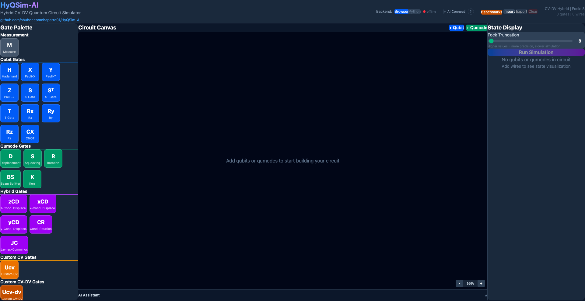

Three regions:

| Region | What it does |
|---|---|
| **Left — Gate Palette** | Gates grouped by type: Qubit, Qumode, Hybrid, Custom |
| **Centre — Circuit Canvas** | Wires and gates. Drag gates here. Time flows left to right |
| **Right — Display Panel** | Run the simulation and inspect the resulting state |

If the header says the backend is **offline**, that is fine — everything below runs in the
browser. The Python backend only adds bosonic-qiskit as an alternative engine.

---

## 2. Build a Bell state by hand

The Bell state |Φ⁺⟩ = (|00⟩ + |11⟩)/√2 is the smallest interesting circuit: two qubits that
are perfectly correlated but individually random.

### 2.1 Add two qubit wires

Click **+ Qubit** twice. Two wires appear, labelled `q0` and `q1`, both starting in |0⟩.

> Clicking a wire's label cycles its initial state through |0⟩, |1⟩, |+⟩, |−⟩, |i⟩, |−i⟩.
> Leave both at |0⟩.

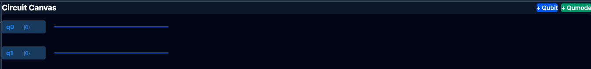

### 2.2 Place a Hadamard on q0

Drag **H** from the Qubit section of the palette onto wire `q0`. This puts q0 into
(|0⟩+|1⟩)/√2 — an equal superposition.

### 2.3 Place a CNOT from q0 to q1

CNOT spans two wires, so it takes **two clicks**:

1. Drag **CX** onto `q0` — this is the **control**. The gate is now pending.
2. Click `q1` — this is the **target**.

The canvas draws the control dot on q0 and the ⊕ on q1, joined by a vertical line.

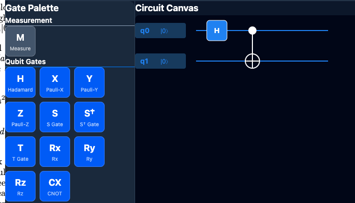

**Every multi-wire gate works this way** — first drop sets the primary wire, second click
sets the target. For hybrid gates the qubit is always the primary.

### 2.4 Run it

Press **Run Simulation** in the right panel.

Look at either qubit's Bloch sphere: the arrow sits at the **centre**, not on the surface.
That is the whole point. Each qubit alone is maximally mixed — no definite state — because
all the information lives in the *correlation* between them. That is entanglement, and it is
visible directly.

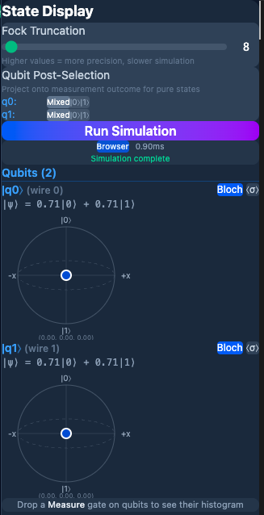

### 2.5 Add measurement

Drag the **M** (Measure) gate onto both `q0` and `q1`, then **Run Simulation** again. A
histogram appears showing roughly 50% `00` and 50% `11` — and crucially **no `01` or `10`**.
The qubits are random, but they are random *together*.

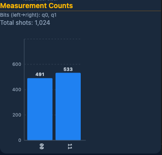

---

## 3. Load a cat state

Now the reason HyQSim exists: circuits mixing **qubits** (discrete, two-level) with
**qumodes** (continuous, infinite-dimensional bosonic modes — a microwave cavity, an
optical mode, a mechanical oscillator).

A **Schrödinger cat state** is a superposition of two coherent states, |α⟩ + |−α⟩ — the
oscillator in two distinguishable places at once. It is prepared by entangling a qubit with
a cavity, then disentangling it in a rotated basis.

The correct construction is eight gates:

```
H → CD(α/√2) → H → S† → H → CD(iπ/(8α√2)) → H → S
```

Rather than drag all eight, load the verified version.

### 3.1 Load it

Click **Benchmarks** in the header → **Cat State**. Set **α** if you like (default 2√2 ≈ 2.83),
and load. The canvas fills with one qumode `m0`, one qubit `q0`, and the eight gates. The
Fock truncation is set to 32 automatically.

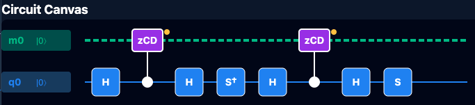

> **Why Fock 32?** A qumode has infinitely many levels; simulation truncates at some maximum
> photon number. A cat with α ≈ 2.8 has significant population up to n ≈ 15, so 8 or 16 would
> clip the state and give wrong answers. Larger is more accurate and slower.

### 3.2 Run it

Press **Run Simulation**, then look at the qumode display. It has four tabs: **Fock**,
**Wigner**, **x̂**, **p̂**.

**Fock** shows the photon-number distribution. Note the **even-numbered peaks only** —
|0⟩, |2⟩, |4⟩ … with the odd levels near zero. That comb is the signature of an even cat
state: the two coherent components interfere destructively at odd photon numbers.

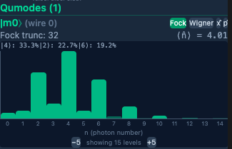

### 3.3 The Wigner function

Switch to the **Wigner** tab. This is the payoff.

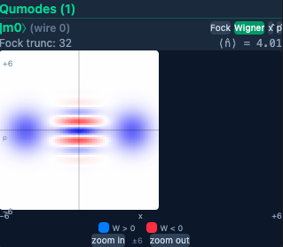

You should see:

- **Two bright lobes**, at roughly x = ±2α — the cat's two "positions"
- **Interference fringes between them**, alternating red and blue

The fringes are the point. A *classical* mixture — the oscillator in one place *or* the
other, you just don't know which — would show two lobes and nothing between them. The
fringes only appear for a genuine quantum superposition, and the **blue regions are
negative**, which no classical probability distribution can be.

Wigner negativity is the accepted witness of non-classicality. You are looking straight at it.

Use the **range** control to zoom the phase-space window, and **Fock** to change how many
levels are plotted.

---

## 4. Sharpen the cat with post-selection

The circuit leaves a small residual correlation between the qubit and the cavity, which
smears the fringes. Conditioning on a qubit measurement outcome removes it.

In the right panel find **Qubit Post-Selection** and set `q0` to **0**. Run again.

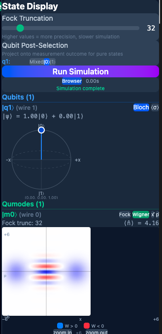

The fringes sharpen. Now set `q0` to **1**: the fringe pattern **shifts by half a period** —
you have selected the *odd* cat instead of the even one. The two outcomes prepare different,
complementary states, which is exactly what measuring an entangled partner does.

---

## 5. The same thing, in one sentence

Everything above can be driven by describing what you want.

### 5.1 Set up the assistant

Get a free API key from [console.groq.com](https://console.groq.com) — no credit card.

Open the **AI Assistant** bar at the bottom, choose **Llama 3.3 70B (Groq)**, paste the key.

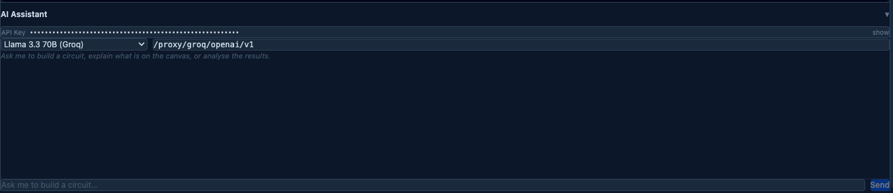

### 5.2 Ask for a circuit

Clear the canvas, then type:

```
Build a cat state circuit with alpha = 2 using a qubit and a qumode
```

The circuit appears. The action line reads **⚙ Loading verified circuit** — the assistant
recognised a circuit HyQSim already has verified and loaded it rather than reconstructing
eight gates from memory. That distinction matters: language models reliably produce
`H → CD` and stop, which is an *aborted* preparation, not a cat state.

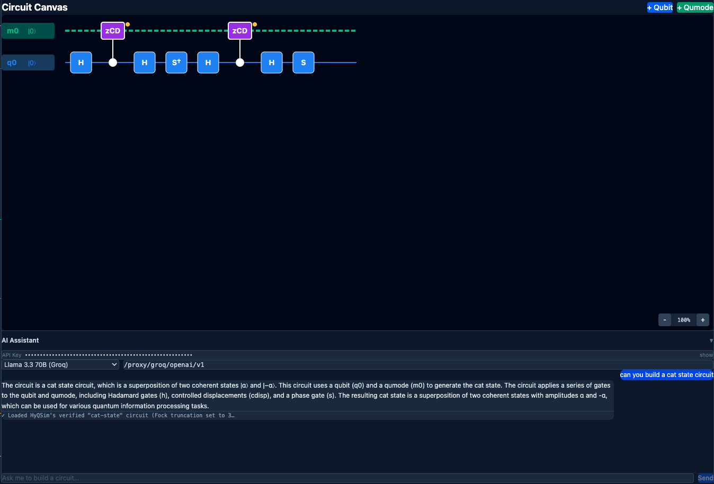

Try a few more:

| Prompt | Result |
|---|---|
| `I want to make a 4-qubit GHZ circuit` | H then a chain of three CNOTs |
| `Add a Hadamard gate on q2` | Appends one gate; leaves the rest alone |
| `Remove the last gate` | Deletes by position |
| `Create a squeezed vacuum state` | One qumode with a squeeze gate |

---

## 6. Ask the AI what it means

With the cat state on the canvas and results computed, ask:

```
What kind of output will this circuit give?
```

Two things happen. First **⚙ Running simulation** — the assistant needs numbers it does not
have, so it triggers HyQSim's simulator and waits. Then it answers using those numbers.

<!-- TODO screenshot: 12-ai-explanation.png — chat response naming the cat state and citing
     real Fock percentages and Wigner negativity. Not captured yet. To add it: save the file
     as docs/images/12-ai-explanation.png, change the marker below from "IMAGE-TODO" to
     "IMAGE", then run: python3 docs/insert-images.py --apply
     IMAGE-TODO: 12-ai-explanation.png -->

**The AI never computes physics.** Every number it reports comes from the simulator you just
ran. If it has no results, it runs one; it is not permitted to state a figure that did not
come from HyQSim. That is enforced in code, not merely requested in the prompt.

More questions worth trying:

| Prompt | What you get |
|---|---|
| `Explain the circuit on the canvas` | Names the state and explains why the gates produce it |
| `Is the Wigner function of this state non-classical?` | Reads the negativity volume and fringes |
| `Why is a conditional displacement used instead of a plain displacement?` | Physics, no canvas changes |
| `What measurement distribution would I see?` | The actual histogram |

Asking for an explanation **cannot** modify your circuit — mutating tools are refused for
read-only requests, so a question can never silently rebuild your work.

---

## Where to go next

| | |
|---|---|
| **[AI_GUIDE.md](AI_GUIDE.md)** | Full AI documentation: both connection modes, the keyword glossary that decides when the simulator auto-runs, the HQC circuit notation, token costs, and testing |
| **[README.md](README.md)** | Architecture, gate reference, and how to add your own gates |
| **Benchmarks menu** | CV→DV and DV→CV state transfer, both parameterised |
| **Import / Export** | Round-trip circuits as bosonic-qiskit or HybridLane Python |

---

## Troubleshooting

**Backend says offline** — expected unless you ran `./install.sh` and started it. Everything
in Parts 1–5 works without it.

**The Wigner plot looks like a blob** — the Fock truncation is too low for the state. The cat
needs 32; raise it in the right panel.

**A gate won't drop on a wire** — gates are lane-typed. Qubit gates only go on `q` wires,
qumode gates only on `m` wires. Hybrid gates need the qubit first, then the qumode.

**The AI returns 404** — the model id has been retired. Run
`cd frontend && GOOGLE_API_KEY=... npm run ai:models -- --verify` to see which ids your key
can actually use. See [AI_GUIDE.md](AI_GUIDE.md).
