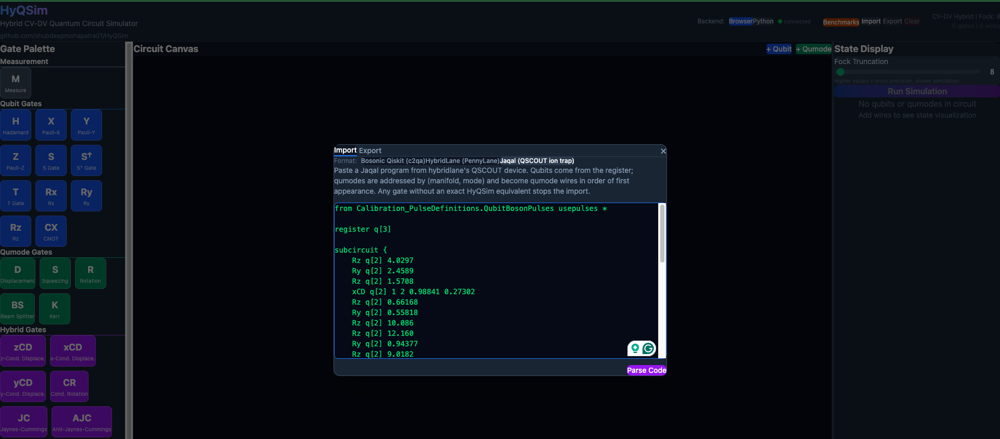

# Jaqal import & export

HyQSim reads and writes **Jaqal**, the Sandia QSCOUT assembly language that
hybridlane's ion-trap device (`hybridlane.devices.sandia_qscout.jaqal`) emits.
The whole cycle runs in the browser — no Python backend, no round trip through
hybridlane.

The dialect is the qubit-boson pulse set,
`Calibration_PulseDefinitions.QubitBosonPulses`.

---

## The demo file

[`examples/knapsack3_probe.jaqal`](examples/knapsack3_probe.jaqal) is a real
probe circuit from the knapsack3 ECD-VQE benchmark — four `xCD` layers driven
from `q[2]`, then a blue-sideband readout pulse on each of the other two qubits:

```
from Calibration_PulseDefinitions.QubitBosonPulses usepulses *

register q[3]

subcircuit {
    Rz q[2] 4.0297
    Ry q[2] 2.4589
    Rz q[2] 1.5708
    xCD q[2] 1 2 0.98841 0.27302
    ...
    Ry q[2] 1.5708
    AJC q[1] 1 2 0.0 0.02
    AJC q[0] 0 2 0.0 0.02
}
```

Two things to notice, because they drive everything below:

- **Qubits come from the register.** `register q[3]` gives three qubit wires,
  addressed `q[0]`, `q[1]`, `q[2]`.
- **Qumodes are not in the register.** They are hardware addresses — the
  `1 2` in `xCD q[2] 1 2 ...` means *manifold 1, mode 2*. This file touches two
  distinct modes, `(1, 2)` and `(0, 2)`, so it needs two qumode wires.

---

## Import

In the app: open **Import**, set the format to **Jaqal (QSCOUT ion trap)**,
paste the program, and hit **Parse Code**.



Or from code:

```ts
import { parseJaqal } from './simulation/jaqalIO';

const result = parseJaqal(source);
// result.success  → true
// result.wires    → 5 wires
// result.elements → 32 gates
// result.warnings → []
```

### What you get

Five wires — the three register qubits first, then one qumode per distinct
`(manifold, mode)` pair **in order of first appearance**:

| Wire | Type   | Jaqal address        |
|-----:|--------|----------------------|
| 0    | qubit  | `q[0]`               |
| 1    | qubit  | `q[1]`               |
| 2    | qubit  | `q[2]`               |
| 3    | qumode | manifold 1, mode 2   |
| 4    | qumode | manifold 0, mode 2   |

Mode `(1, 2)` is wire 3 rather than wire 4 because the first `xCD` line
mentions it long before the final `AJC q[0] 0 2` mentions `(0, 2)`.

Thirty-two gates, one per gate line:

| HyQSim gate | Count | From |
|-------------|------:|------|
| `rz`        | 17    | `Rz` |
| `ry`        | 9     | `Ry` |
| `xcdisp`    | 4     | `xCD` |
| `ajc`       | 2     | `AJC` |

The hardware address is stored on the wire as `Wire.jaqalMode`, which is what
lets the exporter put the circuit back at its original addresses instead of
renumbering the modes.


The canvas scrolls horizontally — the fourth `xCD` layer and the two `AJC`
readout pulses sit off the right edge of the screenshot.

---

## Export

Open **Export** with the format still set to **Jaqal (QSCOUT ion trap)** — the
program is generated as soon as the tab opens, and **Copy to Clipboard** takes
it. Or from code:

```ts
import { generateJaqal } from './simulation/jaqalIO';

const { success, code, error } = generateJaqal(result.wires, result.elements);
```

Exporting the imported demo gives back the same program, gate for gate and
address for address. The only textual differences are trailing zeros that the
number formatter trims:

```diff
-    Rz q[2] 12.160
+    Rz q[2] 12.16
-    xCD q[2] 1 2 0.27375 -0.48410
+    xCD q[2] 1 2 0.27375 -0.4841
```

Both are the same number. Everything else — gate order, wire assignments,
`(manifold, mode)` pairs — is byte-identical.

### The cycle is a fixed point

Import → export → import → export produces **exactly** the same text the second
time. Round-tripping a circuit through the app repeatedly never drifts it. That
property is asserted over the whole corpus in
`jaqalCorpus.test.ts` ("round-trips to a fixed point").

And the two circuits do not merely look alike — they simulate alike. Running
the demo before and after a round trip at `fockDim = 16`:

| Wire | Observable | Before | After |
|------|-----------|--------|-------|
| qumode 3 (mode 1,2) | ⟨n⟩ | 1.005529 | 1.005529 |
| qumode 4 (mode 0,2) | ⟨n⟩ | 0.000400 | 0.000400 |
| qubit 2 | Bloch z | 0.9729 | 0.9729 |

---

## Precision

Parameters are rounded to **6 decimal places** on import and written with at
most 6 decimals on export. Jaqal has no exponent syntax, so the exporter never
writes `1e-7`: values below 1e-6 round to `0.0`, and a parameter too large to
write as a plain decimal (≥ 1e21) is refused rather than emitted in a form no
Jaqal parser would read back.

If you need more precision than that, Jaqal is the wrong interchange format —
use the hybridlane export instead.

---

## Gate coverage

### Imported

| Jaqal | HyQSim | Arguments |
|-------|--------|-----------|
| `Rx` `Ry` `Rz` | `rx` `ry` `rz` | `q[i] θ` |
| `Px` `Py` `Pz` | `x` `y` `z` | `q[i]` |
| `Sz` `Szd` | `s` `sdg` | `q[i]` |
| `zCD` `xCD` `yCD` | `cdisp` `xcdisp` `ycdisp` | `q[i] manifold mode Re(α) Im(α)` |
| `JC` `AJC` | `jc` `ajc` | `q[i] manifold mode φ θ` |
| `Blue` `Red` | `ajc` `jc` | `q[i] order φ θ manifold mode` (legacy) |
| `FockStatePrep` | qumode initial state | `q[i] manifold mode n` |
| `measure_all` | `measure` on every qubit | — |

Note the argument order on the sidebands: **Jaqal writes the phase before the
angle**, so `AJC q[1] 1 2 0.0 0.02` is φ = 0.0, θ = 0.02.

`Blue`/`Red` are the older `qscout.v1.std` spellings. They carry the same
information in a different order — `Blue q[1] 1 0.0 0.02 1 2` is exactly
`AJC q[1] 1 2 0.0 0.02` — and are imported with a warning saying so. Only
first-order sidebands (`order = 1`) map onto the HyQSim gates; anything higher
is refused rather than approximated.

### Exported

Everything in the table above, plus two exact decompositions:

- `h` → `Pz` then `Ry(π/2)`  (this product *is* H, not H up to a phase)
- `t` → `Rz(π/4)`  (T up to a global phase)

Non-`|0⟩` qubit initial states are prepared with a single native rotation
(`|+⟩` → `Ry(π/2)`, `|i⟩` → `Rx(-π/2)`, and so on).

### Not representable

The importer is deliberately strict — **anything it cannot represent exactly is
an error, never a silently dropped line**, and the message says which line and
why. Refused: `loop` blocks, `macro` definitions, `map` aliases, parallel
blocks (`<...>`), a `prepare_all` after a gate, a second qubit register, idle
pulses (`I_*`), and the gates with no HyQSim equivalent (`R`, `Sx`, `Sy`, `XX`,
`YY`, `ZZ`, `MS`, `RampUp`, the native `Beamsplitter`, `Rt_SBProbe`).

A `subcircuit N { ... }` repeat count **is** imported — it is a shot count, not
circuit structure — with a warning telling you to set the shot count in the
simulator instead.

Exporting fails if the circuit contains a gate the trap has no native pulse for
(`squeeze`, `kerr`, `bs`, the custom-generator gates). The error names every
offending gate at once rather than stopping at the first.

---

## Round-tripping a circuit you built on the canvas

A qumode wire dragged onto the canvas has no `jaqalMode`, so the exporter
assigns it the lowest free mode on manifold 1, skipping any address already
claimed by an imported wire. Two wires can never be given the same address —
that would merge them back into a single qumode on re-import and silently
change the physics, so it is refused with an explicit error.

---

## Tests

```bash
cd frontend

npm test                       # everything, including the Jaqal suites
npx vitest run jaqalEdgeCases  # self-contained edge cases — no corpus needed
npx vitest run jaqalCorpus     # runs the real .jaqal corpus, skips if absent
```

`jaqalCorpus.test.ts` walks a directory of real Jaqal programs and checks that
every file either imports or is refused for a deliberately triaged reason, that
no gate line is ever dropped, that every wire index is in range, that every
program round-trips to a fixed point, and that the largest few actually
simulate. Point it at your checkout with:

```bash
JAQAL_CORPUS=~/Documents/hybridlane-benchmarking npm test
```

It currently imports **122 of the 159** files in that corpus. The remaining 37
are generic-Jaqal spec samples that are not the qubit-boson dialect at all —
`loop`/`macro`/`map`/parallel-block examples and Mølmer-Sørensen circuits — and
each is refused with a message naming the construct.
